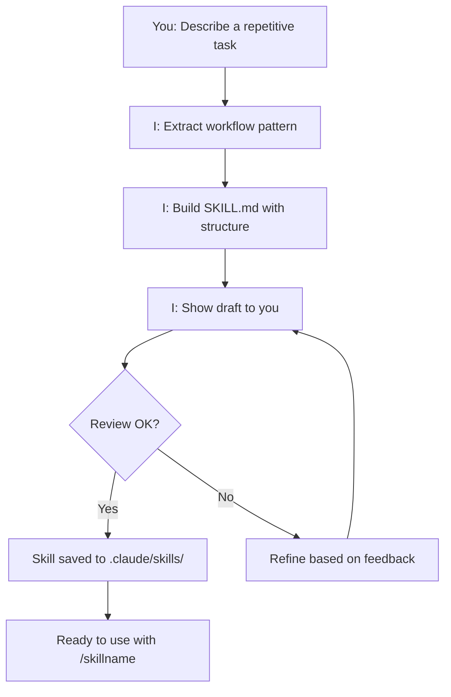

# Skill Creator for Thai2Drive

## Purpose

This skill lets you **create new skills by simply describing them**. No need to write long technical instructions yourself—just explain the workflow, and I build a production-ready SKILL.md.

---

## How It Works

### Step 1: Describe Your Workflow (Plain Norwegian)

Tell me about a task you do repeatedly. Examples:
- *"Jeg sjekker alltid at alle språk (thai, norsk, engelsk) er riktige før en deploy"*
- *"Jeg har en sjekkliste for å validere quiz-spørsmål kvalitet"*
- *"Jeg dokumenterer alltid nye API-endringer før jeg pusher til github"*
- *"Jeg tester alltid at dark mode fungerer på Android, iOS og web"*

### Step 2: I Extract the Pattern

I identify:
- **When** you need this (trigger words, use cases)
- **What steps** you follow (the process)
- **What decisions** you make (branching logic)
- **What tools/checks** you use (quality criteria)
- **What output** you produce

### Step 3: I Build a SKILL.md

I create a production-ready skill file with:
- ✅ Proper YAML frontmatter
- ✅ Clear step-by-step procedures
- ✅ Decision matrices and branching logic
- ✅ Quality checklists
- ✅ Thai2Drive-specific context
- ✅ Example prompts to use it

### Step 4: Testing & Refinement

I ask:
- *"Does this match your workflow?"*
- *"Should I add more detail to step X?"*
- *"Should this be a skill or an instruction?"*

We iterate until it's perfect.

---

## Skill Creation Process



---

## When to Create a New Skill

### ✅ Good Candidates for Skills

- **Quality assurance workflows:** "Check all quiz questions for clarity"
- **Testing procedures:** "Test responsiveness on mobile, tablet, desktop"
- **Deployment checklists:** "Pre-deploy verification for backend changes"
- **Content validation:** "Validate translations are 100% complete"
- **Code review processes:** "Review API contract changes"
- **Debugging workflows:** "Diagnose Thai text encoding issues"
- **Onboarding processes:** "New contributor setup checklist"

### ❌ Not a Skill (Use Direct Help Instead)

- One-off tasks ("Fix this bug", "Write this function")
- Questions without repetition ("How does RevenueChat work?")
- Simple code changes ("Add a button")

---

## Example: From Description to Skill

### What You Say
*"Jeg sjekker alltid at dark mode fungerer på alle plattformer. Jeg tester på Android, iOS web. Jeg sjekker at tekst er leselig, buttons er synlige, og at neon-glowene ikke er for sterke. Jeg også verifiserer at alle språk (thai, norsk, engelsk) rendrer riktig i dark mode."*

### What I Create

A **dark-mode-testing** skill with:

```yaml
---
name: dark-mode-testing
description: 'Verify dark mode across all platforms and languages...'
---

# Dark Mode Testing Skill

## When to Use
- Before merging dark mode features
- When adding new components to dark mode
- When refactoring theme colors

## Platforms to Test
1. **Android** (Expo, real device or emulator)
2. **iOS** (Expo, real device or simulator)
3. **Web** (Expo web, Chrome/Safari/Firefox)

## Verification Checklist
- [ ] Text contrast ≥4.5:1 (WCAG AA)
- [ ] Neon glows are subtle (<0.5 intensity)
- [ ] All buttons are visible and clickable
- [ ] Thai text renders correctly
- [ ] Norwegian text renders correctly
- [ ] English text renders correctly
```

---

## Skill Locations (Thai2Drive)

Skills are stored in one of these folders:

| Path | Scope | Use Case |
|------|-------|----------|
| `.claude/skills/<name>/` | Project (Thailand2Drive) | **Recommended for thai2drive-specific workflows** |
| `.agents/skills/<name>/` | Project (shared agents) | For agent-specific tools |
| `~/.claude/skills/<name>/` | Personal (your machine) | Your personal workflows (not shared) |

---

## After a Skill is Created

### Use It
```
/skill-name [optional argument based on argument-hint]
```

### Share It
Skills in `.claude/skills/` are automatically available to all agents working on thai2drive.

### Update It
If your workflow changes, I can refine the skill:
```
"Update skill-name to include step X" or
"Add a new decision point to skill-name"
```

### Archive It
If you stop using a skill, move or delete it:
```
rm .claude/skills/skill-name/SKILL.md
```

---

## Thai2Drive Skill Ideas to Create

Here are workflows you might want to turn into skills:

| Workflow | Description | Potential Name |
|----------|-------------|-----------------|
| **Translation validation** | Verify Thai/Norwegian/English completeness | `translation-checker` |
| **API contract sync** | Check web API matches mobile expectations | `api-contract-verifier` |
| **Deployment checklist** | Pre-deploy verification steps | `pre-deploy-check` |
| **Michael quality review** | Check teacher pedagogy and tone | `michael-quality-review` |
| **Quiz question audit** | Validate difficulty, clarity, translations | `quiz-quality-audit` |
| **Responsive design test** | Check all breakpoints (mobile, tablet, desktop) | `responsive-design-check` |
| **Performance audit** | Measure API response times, bundle sizes | `performance-audit` |
| **Dark mode verification** | Test dark mode across platforms/languages | `dark-mode-testing` |

---

## How to Invoke Skill Creator

**Option 1: Ask directly**
```
/skill-creator
Jeg gjør alltid det samme når jeg legger til en ny emoji til appen:
1. Jeg finder emoji i Unicode-tabellen
2. Jeg tester at den vises riktig på Android og iOS
3. Jeg sjekker at den ikke quebrer layouten
4. Jeg dokumenterer det i EMOJI.md
Kan du lage en skill for dette?
```

**Option 2: With context**
```
Create a skill for: "Checking that new endpoints are documented in the API README"
```

**Option 3: Via superpowers-workflow**
```
/superpowers-workflow 
Delegate to Skill Creator: Make a skill for validating that quiz images load correctly
```

---

## Related Skills & Documentation

- [superpowers-workflow](../superpowers-workflow/SKILL.md) — Delegate to Skill Creator for new workflows
- [agent-customization](../agent-customization/SKILL.md) — General customization (instructions, agents, hooks)
- [memory-write](../memory-write/SKILL.md) — Save lessons learned
- [context-audit](../context-audit/SKILL.md) — Check token efficiency of your skills

---

## Key Principles

1. **Describe, don't code** — Tell me the workflow in plain Norwegian
2. **Iteration is OK** — First draft might not be perfect; we refine together
3. **Reusable workflows** — Only create skills for repeatable tasks
4. **Local first** — Skills live in `.claude/skills/` (project-specific)
5. **Test before sharing** — Always verify a skill works before deploying

---

## Example Thai2Drive Skill Creations

### Example 1: Translation Checker
```
You: "Jeg må alltid sjekke at Thai-oversettelsen er ferdig før en sprint planlegging."

Me: Creates translation-checker skill with:
- Check which strings are missing Thai translation
- Cross-check against Norwegian and English
- Flag incomplete sections
- Generate report for content team
```

### Example 2: Pre-Deploy Checklist
```
You: "Før vi deployer til Railway, sjekker jeg alltid at databasen er synkronisert, 
      at alle API-keys er satt, og at ingen hemmeligheter er eksponert."

Me: Creates pre-deploy-check skill with:
- Verify environment variables
- Check database migrations
- Scan for exposed secrets
- Test API endpoints
- Generate deployment report
```

---

## Start Creating!

**Next steps:**
1. **Identify** a repetitive workflow you do
2. **Describe it** in plain Norwegian (doesn't have to be perfect)
3. **Say:** `"Create a skill for: [your description]"`
4. **I'll** build it, test it, and show it to you
5. **You review** and we iterate if needed
6. **Done!** Use it with `/skillname`

Ready to create your first skill? 🚀
